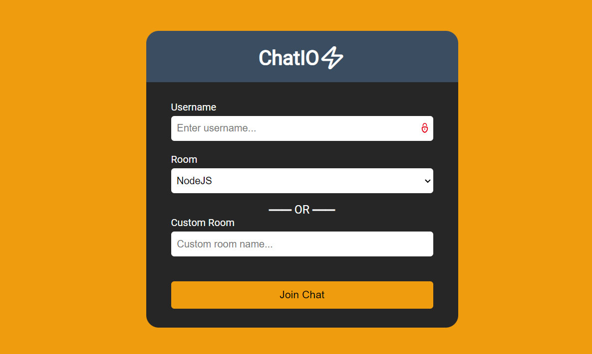
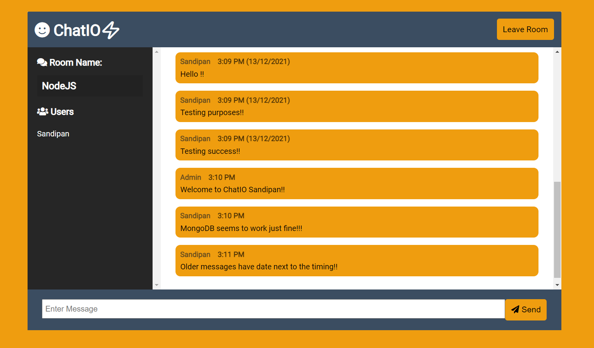

# ChatIO🚀

<!-- PROJECT LOGO -->

[](http://shields.io/)
[](https://GitHub.com/Naereen/StrapDown.js/graphs/commit-activity)

<!-- ABOUT THE PROJECT -->

## Built With

- Frontend: EJS Templating Engine, CSS, Vanilla JavaScript
- Backend: Node.js, Express.js
- Libraries: Socket.io, Mongoose
- Database: MongoDB Atlas
---

# 📈 UML Diagram

<details>
   <summary>Unoptimized Architecture (old)</summary>
   
</details>

<details>
   <summary>Optimized Architecture (revamped)</summary>
   
</details>


<!-- ## 🔥 Screenshots

| Landing Page |
| - |
|  |

| Chat Page |
| - |
|  | -->

## 🚩New Updates

- Added `{user} is typing` functionality.
- Added persistent chat storage in MongoDB Atlas
- Added push notification support on local environment

<!-- BUILT WITH -->  

## How to Install Locally

**1. Fork and clone this repository using**

   ```
   git clone https://github.com/sandip2224/ChatIO.git && cd ChatIO/
   ```  
   
**2. Install required dependencies/dev dependencies using**  

   ```
   npm install && npm install -D && touch .env
   ```  
**3. Add the following key-value pairs inside the .env file**  

> Generate the VAPID keys using the following command:  
> ```
> ./node_modules/.bin/web-push generate-vapid-keys
> ```

  ```
  MONGO_URI=<Unique MongoDB Cluster URL>
  PUBLIC_KEY=<Public VAPID Key>
  PRIVATE_KEY=<Private VAPID Key>
  BASE_URL=<App Server URL> (Either http://localhost:3000 or deployment origin)
  ```

**4. Run server in development mode at `localhost:3000` using**  

  ```
  npm run dev
  ```

---

## 🤎 Found this project interesting?

If you found this project useful, please leave a :star: on Github💔.

---

## ✨ Project Maintained By-
  - [Sandipan Das](https://linkedin.com/in/sandipan0164/)
