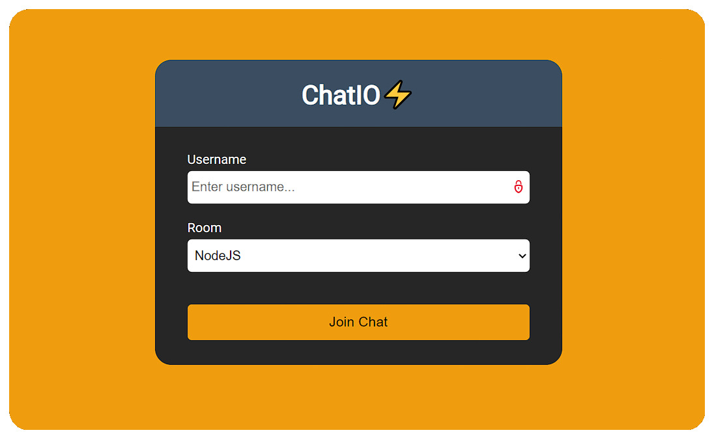
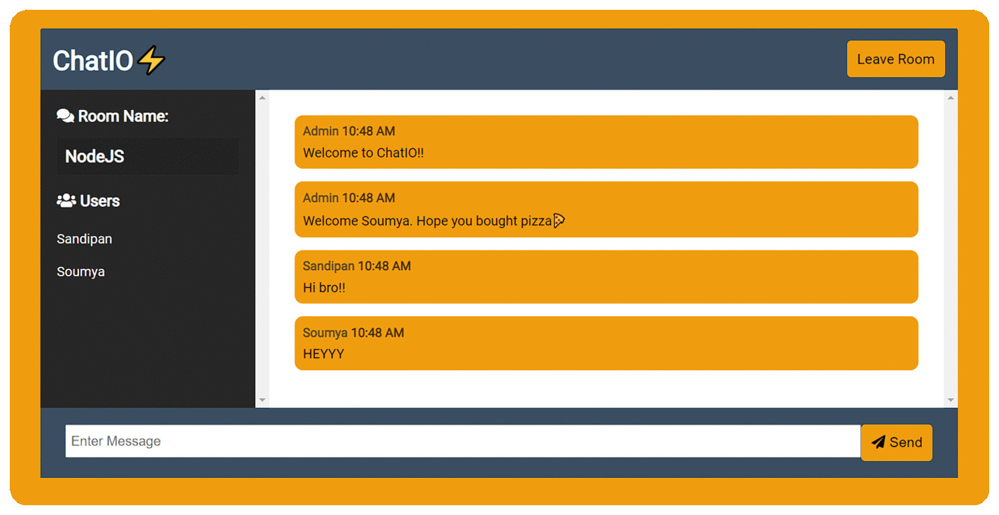

# ChatIO🚀

<p align="center">
   
</p>
<!-- PROJECT LOGO -->

[](http://shields.io/)
[](https://GitHub.com/Naereen/StrapDown.js/graphs/commit-activity)

<!-- ABOUT THE PROJECT -->

## 🎉Live Status

The website is live. Check it out [here](https://chatio64.herokuapp.com)

## Built With

- Frontend
   - EJS Templates
   - CSS
- Backend
   - Node.js
   - Express.js
- Libraries
   - Mongoose
   - Socket.io
- Database
   - MongoDB Atlas
---

## 🔥 Screenshots

| Landing Page |
| - |
|  |

| Chat Page |
| - |
|  |

## 🚩New Updates

- Added `{user} is typing` functionality.
- Added persistent chat storage in MongoDB Atlas


<!-- BUILT WITH -->  

## How to Install Locally

**1. Fork and clone this repository using**

   ```
   git clone https://github.com/sandip2224/ChatIO.git
   cd ChatIO/
   ```  
   
**2. Install required dependencies/dev dependencies using**  

   ```
   npm install
   npm install -D
   ```  
**3. Create a .env file in root directory and add the following key-value pair**  

  ```
  MONGO_URI=<Unique MongoDB Cluster URL>
  ```


**4. Run server in development mode at `localhost:3000` using**  

  ```
  npm run dev
  ```
  
---

## Contributing

If you'd like to contribute, please **fork** the repository and then raise a PR with necessary changes. Thank you.

---

## 🤎 Found this project interesting?

If you found this project useful, then please leave a :star: on Github💔.

---

## :man: Project Maintained By-
  - [Sandipan Das](https://linkedin.com/in/sandipan0164/)
